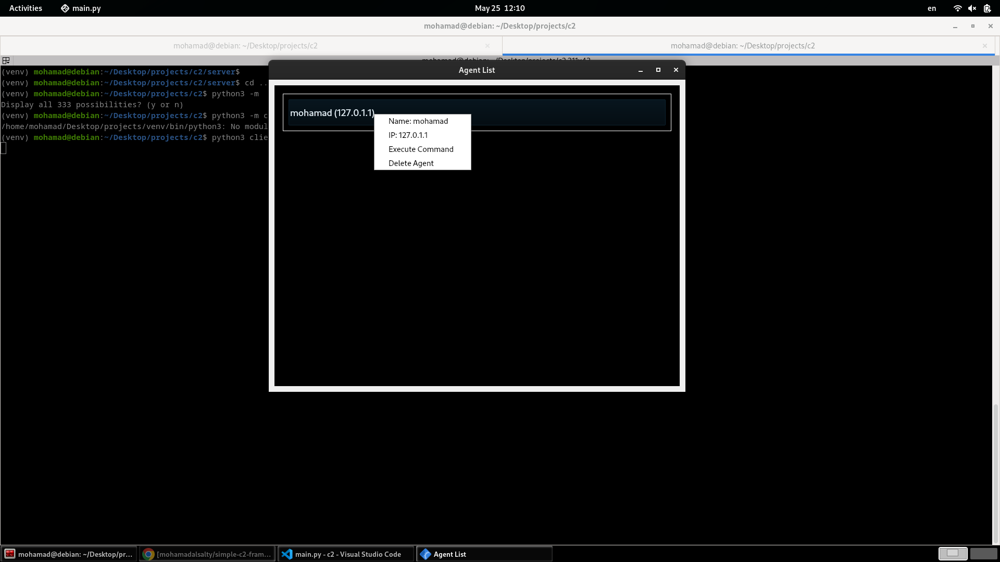

# Simple C2 framework

## Overview

This project is a Command and Control (C2) system designed for Linux. It consists of a server and agents that communicate to execute commands and monitor the status of the agents.

## Features

- **Agent Registration**: Agents register with the server, sending their hostname and IP address.
- **Command Execution**: The server can execute commands on the agents.
- **Ping Check**: The server periodically pings agents to check if they are alive.
- **Agent Management**: The server provides a graphical interface to view, manage, and delete agents.

## Prerequisites

- Python 3.x
- PyQt5
- Basic networking setup

## Installation

1. **Set up a Python virtual environment** (optional but recommended):
   '''
   python3 -m venv venv
   source venv/bin/activate
   '''

2. **Install Python dependencies**:
   '''
   pip install -r requirements.txt
   '''

## Usage

### Starting the Server

1. Navigate to the server directory:
   '''
   cd server
   '''

2. Run the server:
   '''
   python main.py
   '''

3. Enter the port number to listen on when prompted.

### Running the Python Agent

1. Navigate to the client directory:
   '''
   cd client/python
   '''

2. Run the agent:
   '''
   python main.py
   '''

## Code Structure

- **server/**: Contains the server code and PyQt5 graphical interface.
- **client/**: Contains the Python implementation of the agent.

## License

This project is licensed under the MIT License.
